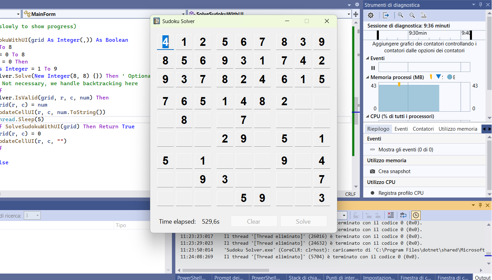

# Sudoku Solver

A VB.NET WinForms application that solves Sudoku puzzles using backtracking.  
Features a 9x9 grid with TextBoxes, keyboard navigation, live solving with a timer, and Clear/Solve buttons.

  

## Features

- 9x9 Sudoku grid with easy keyboard navigation
- Live backtracking solver that updates the grid in real time
- Timer showing solving duration
- Clear and Solve buttons
- ReadOnly mode during solving to prevent editing

## How to Use

1. Enter numbers (1-9) into the grid.
2. Use arrow keys or Enter/Backspace for navigation.
3. Press **Solve** to start the backtracking solver.
4. Watch the solver fill the grid and track the time.
5. Press **Clear** to reset the grid.

## Requirements

- Windows with .NET Framework or .NET 8 (WinForms support)
- Visual Studio (recommended) to open and run the solution

## Notes

- The solver uses backtracking, so solving complex puzzles may take some time.
- UI updates are handled in real-time using a background thread.

## License

This project is open-source. Feel free to use and modify it.
